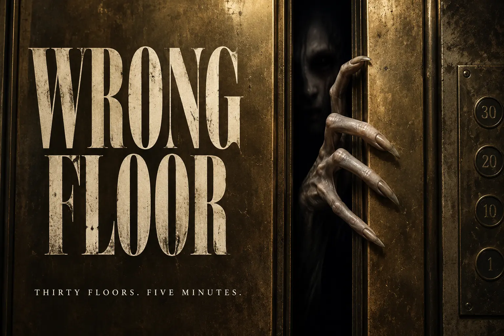

# Wrong Floor



Thirty floors. Five minutes. Close the doors before something gets inside.

Wrong Floor is a first-person 3D observation-horror vertical slice by Luminary Labs. Every seeded run contains 30 ten-second elevator stops, nine entity families, eighteen encounter variants, and exactly 300 seconds of active simulation.

**Status:** development vertical slice `0.3.0`. This repository is the independent home of the five-minute game. It is not the planned full campaign and is not a Steam-ready release.

## Play

After GitHub Pages deploys:

- Landing page: https://luminarylabs-publish.github.io/TheWrongFloor/
- Direct game: https://luminarylabs-publish.github.io/TheWrongFloor/game/

Controls:

- WASD, arrows, or gamepad stick: inspect
- Hold Space or gamepad A: close the doors
- Enter or gamepad B: recenter/confirm
- Escape or Start: pause

Wait through normal floors. Seal the doors when an entity appears. Three false alarms shut down the elevator; an intrusion ends the run immediately.

## Develop and validate

Node.js 22.12 or newer is required.

```sh
npm test
npm run build
npm run serve
```

With Chrome or Chromium installed:

```sh
npm run test:browser
```

The complete real-time five-minute browser acceptance run is intentionally manual:

```sh
npm run review:full
```

Desktop candidate packaging is documented in [desktop/README.md](desktop/README.md). The game is self-contained at runtime; Three.js and the procedural factory modules are bundled locally.

## Provenance

- Historical Nexus Arcade identity: `NXA-000010`
- Version: `0.3.0`
- Migration source: `LuminaryLabs-Dev/NexusArcade-Prototypes@ba5071b7219375980f2085bfb106bc3fedd53193`
- Destination baseline: `LuminaryLabs-Publish/TheWrongFloor@04591fc4021f27ebb7fa1dcaa3eb3adfcf321a14`

The cover is AI-generated promotional concept art, not a gameplay screenshot. Its original bytes and provenance are preserved under [marketing/prototype-cover](marketing/prototype-cover/PROVENANCE.md).

See [docs/README.md](docs/README.md), [docs/rules.md](docs/rules.md), [MIGRATION-MANIFEST.json](MIGRATION-MANIFEST.json), and [THIRD_PARTY_NOTICES.md](THIRD_PARTY_NOTICES.md).

## Expanded floor content

Version 0.3.0 adds fifteen themed observation rooms, five inspection rule types, three skinned threats (nine entities / eighteen encounters total), and event-driven reference audio. A run remains thirty stops and 300 active seconds. See [the expansion and audio contract](docs/expansion-0.3.0.md).

## Authored asylum environments

The fifteen observation rooms, entry and exit lobbies, and playable elevator interior use local Blender GLBs in `game/assets/rooms`. Rooms preload before the run clock starts; unavailable models fall back to the existing procedural scenery. Puzzle plaques, anomalies, characters, elevator controls and door timing remain runtime-owned. The original character integration is retained. Reduced flashes keeps fixture illumination steady; cabin illumination stays steady for control readability.

Run `npm run build` before browser validation. `npm run test:rooms:browser` exercises repeated room transitions and a complete run with all new environment GLBs deliberately blocked. The standard browser review also asserts all fifteen authored themes, both lobbies and the elevator are active. Browser GPU checks are measurements on the test device, not minimum-hardware certification.

## Intro corpse doorkeeper

The title elevator uses original local intro-head.glb and intro-hand.glb assets under game/floor-30/assets. The head has a Smile morph; the hands have four curled fingers and an opposed thumb with worn claws. The existing intro clock drives a short pry, smile, head tilt and shared withdrawal. Hold-to-start and stage durations are unchanged. Soft scares hides the whole character; reduced motion disables head tilt. A failed character load restores the original claws.

Run npm run test:intro:browser after building to verify the visible animation, synchronized disappearance, actual hold-to-start input and blocked-asset fallback. Editable Blender source is in C:/Users/simon/Documents/ChatGPT/Blendering/intro_character/corpse-doorkeeper.blend.

## Opening cinematic

The supplied The Thirtieth Floor shader plays once per page load for40active seconds, capped at30shader frames per second. Made by Luminary Labs fades in during seconds3-5 and out during10-13. During38.8-40 the moving shader crossfades over the live lobby and horror menu; menu input becomes available after the fade. Escape or Skip intro takes the same1.2-second fade. Hidden tabs pause playback. Existing reduced flashes/soft scares suppress lightning and fixture flicker, and reduced motion suppresses camera sway. Shader failure restores the menu. No textures or external runtime requests are needed, and the cinematic GPU context is released afterward.

Run npm run test:cinematic:browser for a40second real-time check of cadence, credit, crossfade and entry. Existing gameplay reviews explicitly use skipIntro only alongside review=1.

Opening audio uses the supplied `horrorintro.wav` (including its rain) during the 40-second shader, crossfading into looping `creepytheme.wav` for the menu. Both follow Master and Ambience volume. Browsers that block autoplay show Enable sound; any click or key unlocks audio at the current cinematic position. Menu music stops on descent and resumes on return to title.
